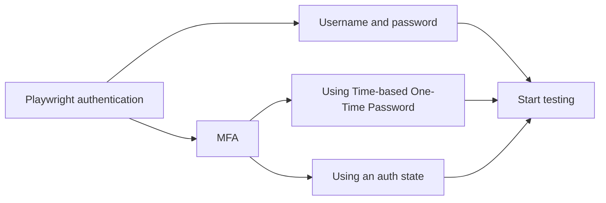

👮‍♀️

---
layout: section
---

<h1 id="auth">AUTH</a>

---

# The options

```mermaid
flowchart LR
  a[Playwright authentication]
  b[Username and password]
  c[MFA]
  d[Using Time-based One-Time Password]
  e[Using an auth state]
  f[Start testing]

  a --> b
  b --> f
  a --> c
  c --> d
  d --> f
  c --> e
  e --> f
```
