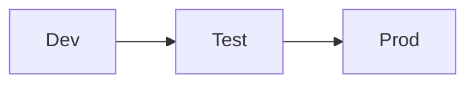
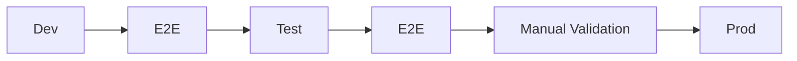

# More test ideas with Playwright

- Test your views, forms, and controls
- Test your business logic
- Test your data connections
- Test your security and permissions
- Test accessibility

---
layout: section
---

# ALM for Power Apps

---

---

# The options

## - GitHub Actions

## - Azure DevOps

## - Power Platform pipelines

---
layout: image
image: .demo/images/boat.png
---

---

# The typical DevOps process

 
 
 

---

# The typical DevOps process

 
 
 

---

# What do you need?

- Microsoft Entra app registration
  - Authenticate our actions for CI/CD against Dataverse
- Power Platform Environments [Dev, (Build), Test, Prod]
- Power Platform application users
  - Connected to the Entra app registration (for every environment)
- CI/CD configuration
  - Power Platform CLI or actions/tasks
  - Service connections

---

# Development

- Export from DEV environment
  - **Managed** and **unmanaged** solutions
- Unpack the solution to have the code
  - Process the `.msapp` file
  - Check-in the code

---
layout: section
---

# Test & Production

## Import the **managed** solution
