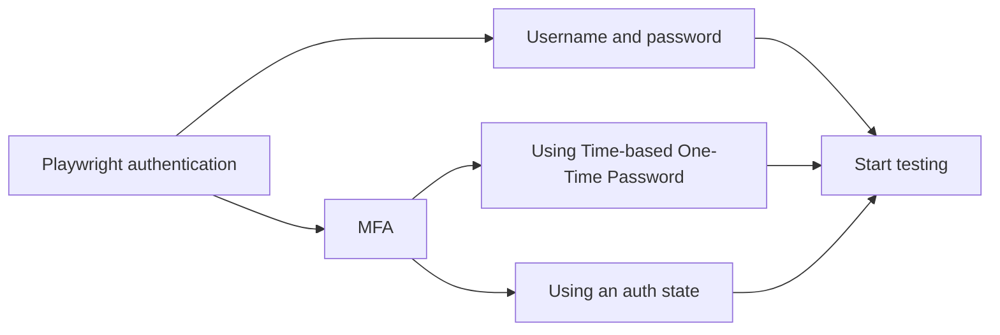
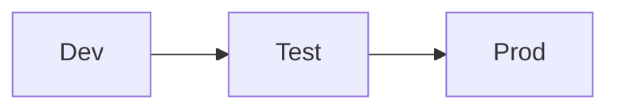
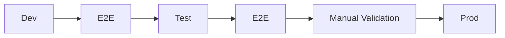

<!-- # Integrate Playwright tests for Power Apps into your DevOps process -->

---
layout: image
image: .demo/images/sponsors.png
---

<!-- # Sponsors -->

---
layout: image
image: .demo/images/about-luise.jpg
---

---
customLayout: .demo/layouts/about-me.hbs
position: left
helloMsg: Hello!
name: Elio Struyf
imageSrc: https://elio.dev/eliostruyf_2024_bw_cutout.png
imageStyle: "background-position: center bottom; background-size: cover;"
job: "Struyf Consulting"
line1: "#Stickerpreneur @ pyod.shop"
line2: "Demo Time / Front Matter CMS"
social1: "eliostruyf.com 🦋 & 🌐"
social2: elio@struyfconsulting.be
transition: slide-up
---

<div class="recognitions">
  
  
  
</div>

<style>
  .recognitions {
    display: flex;
    gap: 1rem;
    background: #F8F8F8;
    padding: 0.5rem;
    border-radius: 0;
    position: absolute;
    z-index: 999;
    bottom: 0;
    right: 0;
  }
</style>

---
layout: default
---

# Low code, but very real bugs


---
layout: default
---


---
layout: section
---

# Why do we need to test Power Apps?

---
layout: image
image: .demo/images/works-on-my-machine-2.webp
---

---
layout: image
image: .demo/images/money.avif
---

---
layout: image
image: .demo/images/time.avif
---

---
layout: section
image: .demo/images/what.avif
---

# Does it work, Accessibility, Performance, and Security

---
layout: section
image: .demo/images/what.avif
---

# Does it work, Accessibility

---
layout: image
image: .demo/images/trust.avif
---

---

# DEMO: the app

<!-- 
https://apps.powerapps.com/play/e/3a13b6f5-38e6-e073-a20c-fe786cecb25c/a/40e8b852-239b-4c3f-bf4b-853ad1d40043?tenantId=b32d3268-2794-435f-865f-ab4779cae11e&hint=f7fd945f-6c3b-4d5e-aeb4-dc1c894ea4af&sourcetime=1748264900270&source=portal# -->

---

# What options do we have for testing this app?

| Feature / Tool           | Manual Testing            | Test Studio               | Power Apps Test Engine (Preview) | Playwright                       |
| ------------------------ | ------------------------- | ------------------------- | -------------------------------- | -------------------------------- |
| Effort to Run            | High (repetitive, manual) | Medium (semi-automated)   | Low (automated via CLI)          | Low (automated via CLI)          |
| Repeatability            | Low                       | Medium                    | High                             | High                             |
| UI Coverage              | Full (but inconsistent)   | Limited to basic controls | Simulates control interactions   | Full UI automation (DOM-based)   |
| Test Authoring           | N/A                       | Point-and-click           | YAML + Power Fx (structured)     | JavaScript/TypeScript scripts    |
| Version Control Friendly | ❌                        | ❌                        | ✅ (tests stored in source)      | ✅                               |
| Suitable for CI/CD       | ❌                        | ❌ (no CLI support)       | ✅ (via Power Platform CLI)      | ✅ (easily with any pipeline)    |
| Debuggability            | Manual observation        | Very limited logs         | Logs, screenshots, trace files   | Screenshots, logs, video, traces |
| Learning Curve           | None                      | Low                       | Medium (Power Fx + YAML)         | Medium (JS + browser concepts)   |
| Cross-Platform/Browser   | ✅ (human)                | ❌                        | ✅ (Chromium, Firefox, WebKit)   | ✅ (Chromium, Firefox, WebKit)   |
| Production Readiness     | ✅                        | ✅                        | ❌ (Preview; not for production) | ✅                               |

---
layout: section
---

# Why Playwright?

---

# Why Playwright?

- Not in preview
- Uses a common language to work with the browser
- Became a standard for testing and automation
- Cross-browser / cross-platform / cross-language
- Full control over tests and scripts 👉 debugging
- Easy to integrate into CI/CD pipelines
- No vendor or platform lock-in
- Strong community and ecosystem

---
layout: section
---

# Starting with Playwright

---
layout: image-right
image: .demo/images/website.png
---

# Using Playwright

<br />
<br />

### Navigation

```ts
await page.goto('https://eliostruyf.com');
```

<br />

### Get an element

```ts
const title = page.locator('header h2');
```

<br />

### Test assertion

```ts
await expect(title).toHaveText('Elio Struyf');
```

<dt-show clicks="1">

<dt-arrow
  x1="365"
  y1="390"
  x2="470"
  y2="25"
  line-color="#ff69b4"
  line-width="2"
  arrow-head="both">
</dt-arrow>

</dt-show>

---

# DEMO: Website test

---
layout: default
invert: true
---

👮‍♀️

<style>
  p {
    font-size: 300px;
    text-align: center;
  }
</style>

---
layout: section
---

# AUTH

<style>
  h1 {
    font-size: 250px !important;
    text-align: center;
  }
</style>

---

# The options



---

# Using the TOTP

```ts
import { test as setup } from "@playwright/test";
import { login } from 'playwright-m365-helpers';

const AuthFile = "playwright/.auth/user.json";

setup("authenticate", async ({ page }) => {
  await login(
    page,
    process.env.M365_PAGE_URL,
    process.env.M365_USERNAME,
    process.env.M365_PASSWORD,
    process.env.M365_OTP_SECRET // Optional
  );

  await page.context().storageState({ path: AuthFile });
});
```

---

# DEMO: Authentication

---
layout: section
---

# Power Apps is a weird beast

---
layout: section
---

# 🧚‍♀️ It uses magic 🪄

---


---


---
layout: section
---

# And it keeps a dinosaur alive 🦖

---

# The canvas (read iframe)


---
layout: section
---

# Playwright tests for Power Platform

---

# Retrieving an element

```ts
// Get the iframe canvas
const iframe = page.frameLocator("iframe#fullscreen-app-host");
const publishedCanvas = iframe.locator("#publishedCanvas");

// Retrieve the control to test/use
const textInputControl = publishedCanvas.locator(`div[data-control-name='TextInput1']`);
const textInput = textInputControl.locator("input");

// Use the control
await textInput.fill("Hello World");
```

---

# The simplified version with M365 Helpers

```ts
// Get the iframe canvas
const appFrame = await getAppFrame(page);

// Retrieve the control to test/use
const textInput = getInput(appFrame, "TextInput1");

// Use the control
await textInput.fill("Hello World");
```

---

# DEMO: Power Apps tests

---

# More test ideas with Playwright

- Test your views, forms, and controls
- Test your business logic
- Test your data connections
- Test your security and permissions
- Test accessibility

---
layout: section
---

# ALM for Power Apps

---


<style>
  img {
    height: 450px;
    margin: 0 auto;
  }
</style>

---

# The options

- GitHub Actions
- Azure DevOps
- Power Platform pipelines 💰

---


<style>
  img {
    height: 540px;
    margin: 0 auto;
  }
</style>

---

# The typical DevOps process

<br />
<br />
<br />



---

# The typical DevOps process

<br />
<br />
<br />



Dev
- Export from DEV environment
  - **Managed** and **unmanaged** solutions
- Unpack the solution to have the code

Test
- Import the **managed** solution

Prod:
- Import the **managed** solution

---

DEMO: Playwright in GitHub Actions

---

# Outro

- Present ourselves

---
layout: image
image: .demo/images/thank-you.png
---

<!-- # Thank you! -->
